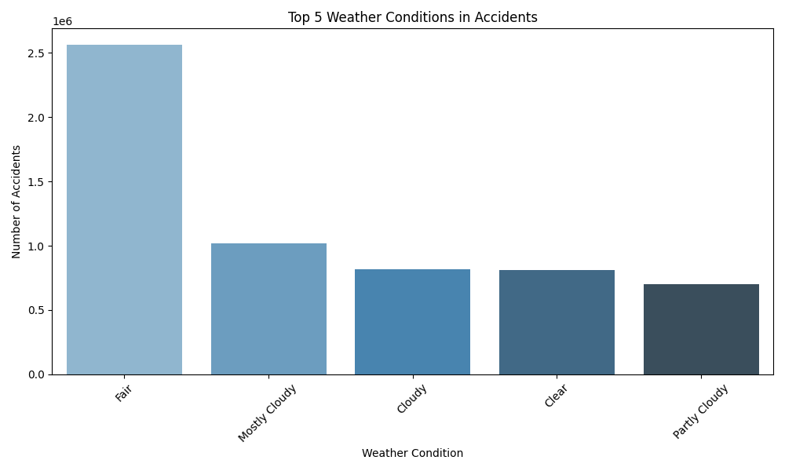
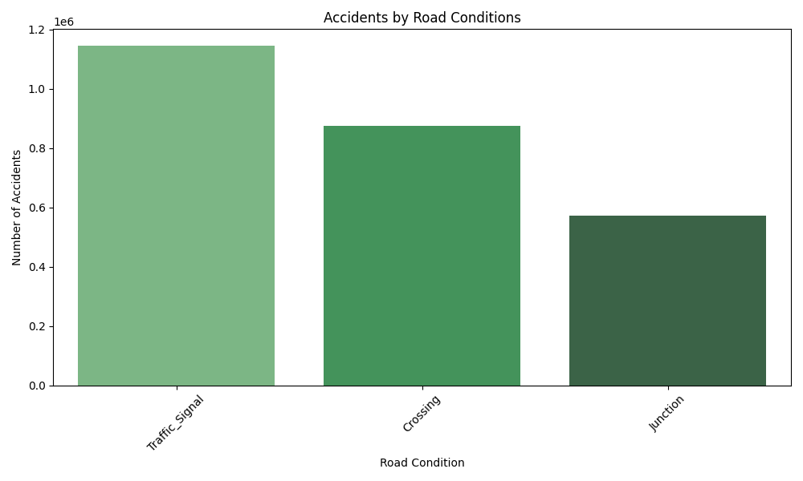
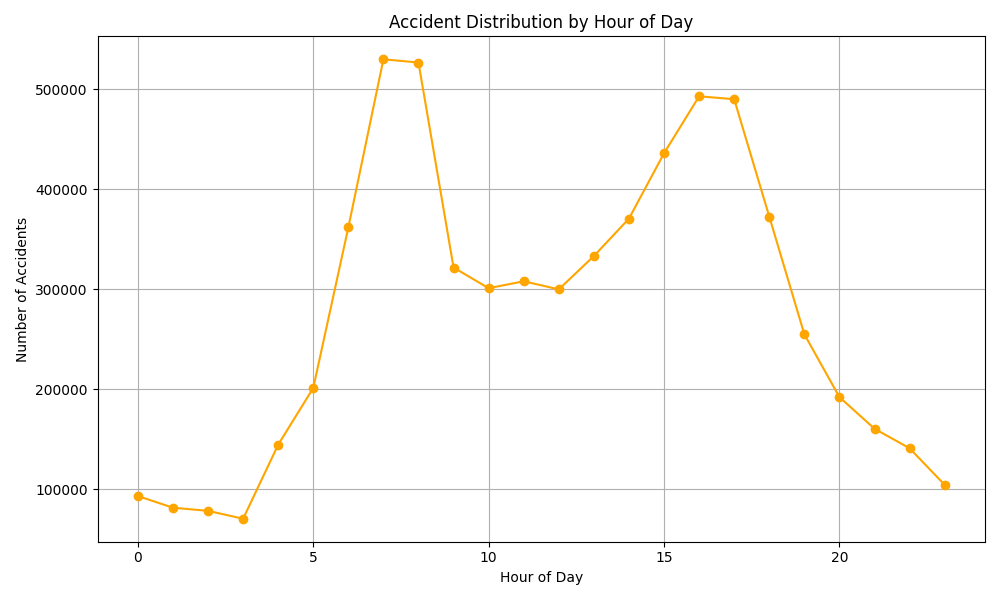
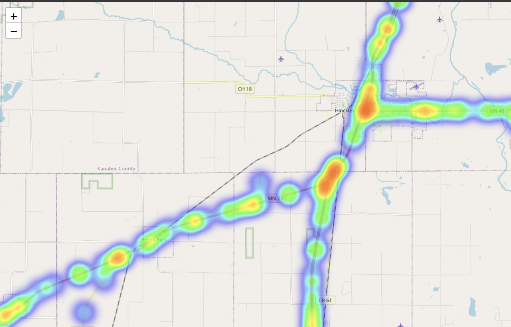

# 🌟 Traffic Accident Analysis Project

  
  


## 📖 Overview
This project, **Task 4** of my **SkillCraft Technology Internship - Data Science** role, analyzes the US Accidents dataset to identify patterns related to road conditions, weather, and time of day, and visualizes accident hotspots and contributing factors. The goal is to provide actionable insights for improving road safety and traffic management.

## 🗃️ Dataset
- **Source**: [Kaggle - US Accidents Dataset](https://www.kaggle.com/datasets/sobhanmoosavi/us-accidents)
- **File**: `dataset4.csv` (renamed from the original dataset)
- **Size**: 7,728,394 records, 46 attributes
- **Key Features**:
  - Geographic: `Start_Lat`, `Start_Lng`
  - Temporal: `Start_Time`, `Hour`, `Day_of_Week`
  - Weather: `Weather_Condition`, `Precipitation(in)`, `Temperature(F)`
  - Road Conditions: `Traffic_Signal`, `Crossing`, `Junction`

## 🔍 Methodology
### 1. Data Loading & Initial Exploration
- Loaded `dataset4.csv` using Pandas and explored its structure (7.7M rows, 46 columns).
- Identified missing values and converted `Start_Time` to datetime for time-based analysis.

### 2. Exploratory Data Analysis (EDA)
- Analyzed patterns in weather (e.g., `Weather_Condition`), road conditions (e.g., `Traffic_Signal`), and time (e.g., `Hour`, `Day_of_Week`).
- Key findings informed the visualizations.

### 3. Visualizations
- Created a heatmap of accident hotspots (view `accident_hotspots.html`).
- Generated bar charts for weather and road condition impacts.
- Plotted hourly accident trends with a line chart.

## 📊 Key Findings
- **Accident Hotspots**: Visualized concentrations of accidents, likely near urban centers or major highways (see `accident_hotspots.html`).
- **Weather Impact**: Most accidents occurred in `Clear` conditions (57,255), followed by `Overcast` (10,255) and `Light Rain` (3,211), suggesting weather plays a role but clear conditions dominate due to higher traffic volume.
- **Road Conditions**: 10,699 accidents at `Traffic_Signal` (10.7%), 6,489 at `Crossing` (6.5%), and 10,434 at `Junction` (10.4%), highlighting intersection risks.
- **Time Patterns**: Peaks at 11 AM (7,910) and 8 PM (7,404), with highest days being Thursday (18,008) and Wednesday (17,438), indicating rush hours and midweek trends.

## 🖼️ Visualizations





## 🛠️ Tools & Techniques Used
  
  
  
  
  
  


## 📂 Repository Structure
- `dataset4.csv`: The renamed US Accidents dataset.
- `traffic_analysis.py`: Python script for EDA and visualizations.
- `accident_hotspots.html`: Interactive heatmap of accident hotspots.
- `weather_conditions.png`: Bar chart of top weather conditions.
- `road_conditions.png`: Bar chart of road condition impacts.
- `hourly_trends.png`: Line chart of hourly accident trends.
- `HTML MAP FILE LINK`: https://drive.google.com/file/d/1bNiQeCDnbVzTNY2S7rDPL6bIO0xZ6N_l/view?usp=sharing.

## 🚀 How to Run
1. **Clone the Repository**:
   ```bash
   git clone https://github.com/your-username/Traffic-Accident-Analysis.git
   ```
2. **Install Dependencies**:
   ```bash
   pip install pandas matplotlib seaborn folium
   ```
3. **Run the Script**:
   ```bash
   python traffic_analysis.py
   ```
4. **View Results**:
   - Check the console for EDA output.
   - Open `accident_hotspots.html` in a web browser for the heatmap.
   - View images (`weather_conditions.png`, `road_conditions.png`, `hourly_trends.png`) in the repository.

## 💡 Future Improvements
- Analyze the full dataset for more precise patterns.
- Incorporate severity levels into visualizations.
- Use clustering to identify additional hotspot patterns.

## 👩‍💻 Author
**Arous**  
SkillCraft Technology Intern - Data Science  
📅 Completed: June 27, 2025  
📧 Contact: [Email](shubhamkuya@gmail.com)/[LinkedIn](https://www.linkedin.com/in/shubham-kumar-46422128a/)  

## 📜 License
This project is licensed under the MIT License - see the [LICENSE](LICENSE) file for details.
